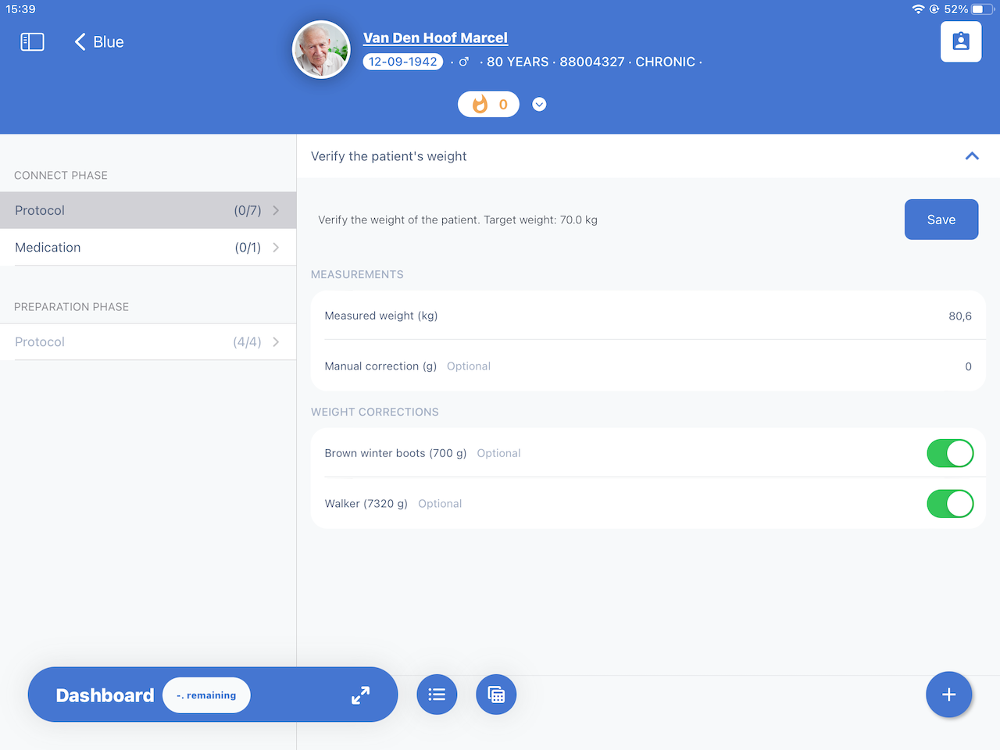

## Code Block

```js
console.log('Hello World');
```



<Badge text="Test" />

<Note text="This is a note" />

## Cards

<Cards>
  <Card title="Learn more about Next.js" href="https://nextjs.org/docs" />
  <Card title="Learn more about Fumadocs" href="https://fumadocs.vercel.app" />
</Cards>
